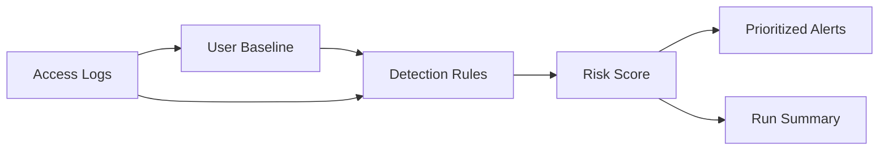

# Privacy Access Monitor

An explainable Python pipeline for detecting unusual access to sensitive customer data using **behavioral baselines, rule-based controls, and risk scoring**.

> This repository uses fully synthetic data. It does not contain or reproduce employer data, internal thresholds, proprietary systems, or production detection logic.

## Why this project

Privacy and security monitoring often requires more than checking whether an employee technically has access. A useful control also asks whether the access pattern is **reasonable for that user, at that time, from that location, and at that volume**.

This project demonstrates a small, auditable monitoring pipeline that turns raw access logs into prioritized alerts.

## Detection coverage

The monitor currently detects:

- off-hours access
- weekend access
- geographic mismatch
- unusually large exports
- access to systems outside a user's behavioral baseline
- bursts of access across many distinct customers

Each rule contributes to an explainable 0–100 risk score.

## Architecture



See [`docs/architecture.md`](docs/architecture.md) for details.

## Example

A customer-support user exporting 2,500 customer records at 02:14 triggers:

- `OFF_HOURS` (+20)
- `EXPORT_SPIKE` (+45)

Result: **65 / 100 — high severity**

A burst of access to 15+ distinct customers in ten minutes receives an additional `BULK_CUSTOMER_BURST` signal.

## Project structure

```text
privacy-access-monitor/
├── data/
│   └── sample_access_logs.csv
├── docs/
│   ├── architecture.md
│   └── methodology.md
├── output/
│   ├── sample_alerts.csv
│   └── summary.json
├── src/
│   ├── generate_data.py
│   ├── detection_rules.py
│   ├── risk_engine.py
│   └── run_monitor.py
├── tests/
│   ├── test_detection_rules.py
│   └── test_risk_engine.py
├── requirements.txt
└── README.md
```

## Run it

Create an environment:

```bash
python -m venv .venv
```

Windows:

```powershell
.\.venv\Scripts\python.exe -m pip install -r requirements.txt
.\.venv\Scripts\python.exe src\generate_data.py
.\.venv\Scripts\python.exe src\run_monitor.py
.\.venv\Scripts\python.exe -m pytest -q
```

macOS/Linux:

```bash
source .venv/bin/activate
pip install -r requirements.txt
python src/generate_data.py
python src/run_monitor.py
pytest -q
```

## Outputs

`output/sample_alerts.csv` contains prioritized events with:

- triggered rules
- risk score
- severity
- access context
- synthetic anomaly label for demonstration

`output/summary.json` contains run-level metrics and a clearly labeled evaluation against the synthetic injected ground truth.

## Design principles

**Explainability over black-box scoring**  
Every score is traceable to named rules.

**Reproducibility**  
The synthetic generator uses a fixed random seed by default.

**Privacy-safe demonstration**  
No real employee or customer data is used.

**Auditability**  
Inputs, triggered rules, score, and severity remain reviewable at event level.

## Limitations

This is a portfolio demonstration, not a production UEBA system. The sample thresholds are illustrative and should not be interpreted as recommended production values. Real deployments require business-purpose context, entitlement data, peer groups, exception handling, rule governance, and privacy controls for workforce monitoring.

## Tech

Python · Pandas · Rule-Based Detection · Behavioral Baselines · Privacy Monitoring · Risk Scoring
