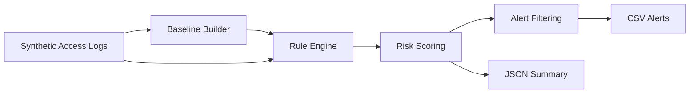

# Architecture

## Components

- **Synthetic log generator** creates reproducible access events and injects labeled anomalies.
- **Baseline builder** learns each user's common systems from ordinary business-hour activity.
- **Rule engine** evaluates temporal, geographic, behavioral, export, and burst conditions.
- **Risk engine** combines triggered controls into an explainable 0–100 score.
- **Reporting layer** exports reviewable alerts and a machine-readable run summary.

The design is intentionally transparent and auditable: every alert can be traced back to the rules that contributed to its score.
